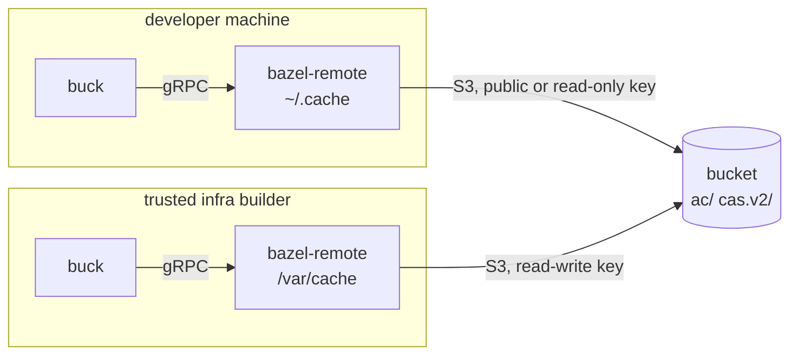

# The shared build cache

Buck can take an action's result over its [remote execution
API](https://buck2.build/docs/users/remote_execution/) instead of running it locally.
[bazel-remote](https://github.com/buchgr/bazel-remote) and similar projects can use an S3 bucket as a
storage backend to implement a shared cache for Buck. Then a developer machine or an isolated CI build
can download all the expensive package/Go/Rust etc. builds from the cache instead of having to re-do them
on their own machine, and only build the inputs that were actually changed locally. Which actions are
cached at all is decided in the graph, not here: see [reproducibility and
caching](design.md#reproducibility-and-caching).

Every party runs a local `bazel-remote` instance; tine drives that internally:



## Client-side setup

A project enables remote caching by declaring the bucket in its committed `tine.toml`:

```toml
[cache]
endpoint = "s3.example.com"
bucket = "builds"
```

Anything that differs per machine goes into `tine.local.toml` (gitignored):

```toml
[cache]
key_file = "~/.config/myproject-cache.token"
```

| key           | default            | meaning                                               |
|---------------|--------------------|-------------------------------------------------------|
| `endpoint`    | required           | host name, without a scheme                           |
| `bucket`      | required           | bucket name                                           |
| `region`      | `auto`             | cloud-provider specific                               |
| `key_file`    | none               | one line, `<key id> <secret>`; see [keys](#keys)      |
| `write`       | `false`            | a builder sets this, and then needs a `key_file` too  |
| `auth_method` | `access_key`       | `access_key`, `iam_role` or `aws_credentials_file`    |
| `dir`         | derived, see below | the local half of the cache                           |
| `max_size`    | `20`               | GiB, see below                                        |
| `port`        | derived from `dir` | what the shim serves on                               |
| `enabled`     | `true`             | `false` in `tine.local.toml` builds without the cache |

The two auth methods that find their own credentials need no `key_file`. The shim inherits every
`AWS_*` variable, which is where those credentials live, and `HTTP_PROXY`, `HTTPS_PROXY` and
`NO_PROXY`.

`max_size` is a target `dir` is kept under by evicting the least recently used entries, so a too small
value costs extra bucket requests. Its size also decides how much of the bucket a build has to ask
about: bazel-remote answers buck's "which of these blobs do you have?" locally where it can, and every
miss is an S3 request. A build runner therefore should put `dir` on persistent storage.

Tine owns `[buck2_re_client]`, so a project which writes that section itself is refused.

The next `bin/tine buck` command fetches the pinned bazel-remote, starts it if nothing is already serving
that cache, writes the address buck needs into `.buckconfig.local`, and replaces the buck daemon (it
reads that address only on startup). Check that it works: `Cache hits` in the build summary stops being
0%.

`tine cache-status` reports what serves the cache, what its local half holds, and the pid serving it.
The shim outlives the build that started it and exits after fifteen minutes without a request. Kill
that pid to stop it sooner.

### Keys

Without a `key_file`, tine configures the shim to send unsigned requests, which works for [public
buckets](#a-public-bucket). A bucket that expects a key needs one: it answers an unsigned request 403,
bazel-remote reports that as a miss, and the build succeeds with nothing cached. The 403s are in the
shim's log.

### One shim per cache directory

Two checkouts with the same `dir` share one shim and thus one local cache. The shim holds a lock on
`dir` for as long as it runs, so a second one cannot start over the same directory.

A shim which is configured differently, for another bucket or with a write key, is refused rather than
shared, naming the pid holding the directory. Kill that pid, wait for it to idle out, or give the
project a `dir` of its own. The default `dir` is
`${XDG_CACHE_HOME:-~/.cache}/bazel-remote/<hash of endpoint and bucket>`, so that two projects with
different buckets do not collide.

## Bucket setup

Create a bucket, then one read-write key per builder, and one read-only key to hand to developers if the
bucket cannot be [public](#a-public-bucket). Consider egress costs when deciding the provider, as
developers and build jobs will regularly download gigabytes.

Objects are `ac/` for action results and `cas.v2/` for their outputs.

`bazel-remote` sends each blob as a single request rather than a multipart upload, so the largest cacheable
artifact is whatever the endpoint's single-upload limit is, commonly 5 GiB.

An upload is queued, and the build neither waits for one nor is told that it failed: a full queue logs
"too many uploads queued" and drops the blob, and a rejected write is one more line in the log. A key
without write permission looks exactly like that -- the build still succeeds, and the only symptom is "S3
UPLOAD bucket key Access Denied." The shim logs every request, including every failed one, at the path
`tine cache-status` prints; watch it if the cache stops filling. An unreachable endpoint or a rejected
key shows up there and nowhere else. Each start truncates the log, so it covers only the running shim.

**Warnings**:

 - whoever holds the write key can upload poisoned artifacts, so a client has to check a fetched
   blob against the digest it asked for. Released bazel-remote compares only its size; fix sent
   upstream as [#922](https://github.com/buchgr/bazel-remote/pull/922), our pinned fork contains it.

 - the pinned build also contains [#923](https://github.com/buchgr/bazel-remote/pull/923), so the S3
   backend asks whether the bucket already has a blob before sending it. Without it, bazel-remote uploads
   identical blobs multiple times.

### Expiry

**Set no expiry rule.** An action result and the blobs it names are separate objects that age
independently, so an age-based rule expires some of a result's blobs and leaves the result behind. Buck
then takes the cache hit, cannot fetch the bytes, and fails the action with "Internal error: Failed to
download trees" instead of running it.

Nothing catches it in between, because nothing validates a result against its blobs any more: doing so
costs one request per file in its output tree, which is why the shims disable it with
`--disable_grpc_ac_deps_check`, and there is no server in front of the bucket to do it for them.
Making those checks cheap enough to leave on is
[bazel-remote#919](https://github.com/buchgr/bazel-remote/issues/919); the other fix is in buck, which
could fall back to running an action whose result it cannot download, ideally as an option so existing
behaviour is unchanged. Until one of them lands, expiring blobs breaks builds.

Emptying the bucket completely is safe: every lookup misses and every action runs. If you do it, delete
`ac/` before `cas.v2/`, so the window in between holds orphaned blobs rather than orphaned results, and
have everyone drop their local `dir` too: it can hold a result whose blobs it has evicted and used to
fetch from the bucket.

### A public bucket

For an open project you can make the bucket public-read instead and publish the endpoint instead of
handing out read keys. Reading is anonymous, writing still needs a key, and nothing else changes.

What matters is that the storage actually serves **unsigned S3 requests**; a bucket policy granting
`s3:GetObject` to everyone is the usual way to say so. Caveats:

- **Cloudflare R2 has no anonymous S3 API.** Its
  [public access](https://developers.cloudflare.com/r2/buckets/public-buckets/) is an `r2.dev` subdomain
  or a custom domain, and both serve objects over plain HTTP rather than the S3 endpoint, so neither is
  reachable this way. Should that change, publish a custom domain and not the `r2.dev` one: reading a
  graph is tens of thousands of requests in a couple of minutes, which hits the `r2.dev` rate-limiting.
- **A plain-HTTP endpoint does not fit `--http_proxy.url` either**, which is the obvious thing to reach
  for once the S3 API is closed to you. That client asks for `<url>/cas.v2/<hash>`, and the object is at
  `cas.v2/<hh>/<hash>`, so every request misses. Serving a public bucket that way needs an URL rewrite
  service in front of it that inserts the two hash digits; the stored bytes are already the format that
  client expects.
