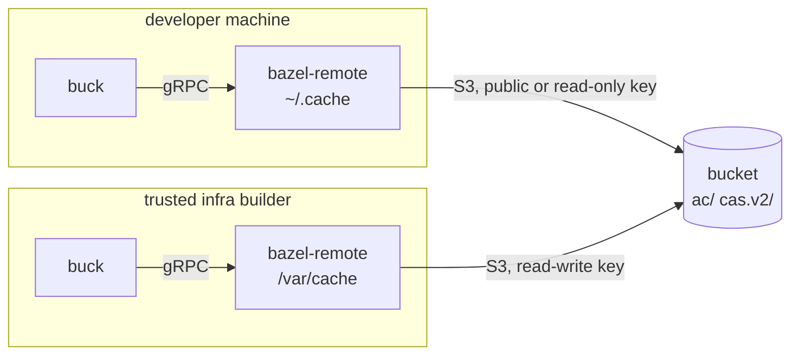

# The shared build cache

Buck can take an action's result over its [remote execution
API](https://buck2.build/docs/users/remote_execution/) instead of running it locally.
[bazel-remote](https://github.com/buchgr/bazel-remote) and similar projects can use an S3 bucket as a
storage backend to implement a shared cache for Buck. Then a developer machine or an isolated CI build
can download all the expensive package/Go/Rust etc. builds from the cache instead of having to re-do them
on their own machine, and only build the inputs that were actually changed locally. Which actions are
cached at all is decided in the graph, not here: see [reproducibility and
caching](design.md#reproducibility-and-caching).

Every party runs a local `bazel-remote` instance:



## Developer setup

**Note**: This is provisional. Once this settles, we'll integrate this into `bin/tine`.

### bazel-remote setup

Fetch a [release binary](https://github.com/buchgr/bazel-remote/releases). Start it with the
read-only key:

```sh
bazel-remote --dir ~/.cache/bazel-remote --max_size 20 \
    --grpc_address 127.0.0.1:9092 --disable_grpc_ac_deps_check --num_uploaders 0 \
    --s3.endpoint <host> --s3.bucket <bucket> --s3.region <region> \
    --s3.auth_method access_key --s3.access_key_id <id> --s3.secret_access_key <secret>
```

Against a [public bucket](#a-public-bucket) there is no key to configure:

```sh
--s3.signature_type anonymous --s3.access_key_id unused --s3.secret_access_key unused
```

`anonymous` is what stops the request being signed. The key and secret still have to be present and
non-empty.

| flag | why |
|------|-----|
| `--num_uploaders 0` | disable uploads; they would fail with a read-only key |
| `--disable_grpc_ac_deps_check` | expensive, and the reason for no bucket expiry; see [Expiry](#expiry) |
| `--max_size` | soft limit of the `--dir` size, a non-zero value in GiB |
| `--s3.region` | cloud-provider specific |

`--max_size` is a target the local `--dir` is kept under by evicting the least recently used
entries, so a too small value costs extra bucket requests. Eviction is asynchronous, so the
directory can overshoot on a burst of writes; set `--max_size_hard_limit` if that matters.

Do not pass `--storage_mode`. The default `zstd` is what stores and transfers compressed blobs, and it
decides the object layout, so every party has to agree on it.

### tine setup in a consuming project

In `.buckconfig.local`, **below** the `# @end generated by tine` marker:

```ini
[buck2_re_client]
address = 127.0.0.1:9092
tls = false
```

Then `bin/tine buck kill`, as the address is only read when the daemon starts.

Check it works: `Cache hits` in the build summary stops being 0%.

To turn it off, delete the `[buck2_re_client]` section and `bin/tine buck kill`.

## Build runner setup

Same `[buck2_re_client]` config, and the same command with two differences: a read-write key, and no
`--num_uploaders 0`.

Uploads are queued, and the build never waits for one. It is also never told when one fails: a full queue
logs "too many uploads queued" and drops the blob, and a rejected write is one more line in the log. A key
without write permission looks exactly like that -- the build still succeeds, and the only symptom is
"S3 UPLOAD bucket key Access Denied." Watch that log if the cache stops filling.

Give `--dir` persistent storage, so that it gets shared between build jobs. It also decides how much of
the bucket a build has to ask about: bazel-remote answers buck's "which of these blobs do you have?" from
the local directory where it can, and every miss is an S3 request.

## Bucket setup

Create a bucket, then one read-write key per builder, and one read-only key to hand to developers if the
bucket cannot be [public](#a-public-bucket). Consider egress costs when deciding the provider, as
developers and build jobs will regularly download gigabytes.

Objects are `ac/` for action results and `cas.v2/` for their outputs. If the bucket contains other data,
consider setting `--s3.prefix`.

`bazel-remote` sends each blob as a single request rather than a multipart upload, so the largest cacheable
artifact is whatever the endpoint's single-upload limit is, commonly 5 GiB.

**Warnings**:

 - whoever holds the write key can upload poisoned artifacts. A client should check a
   fetched blob against the digest it asked for, but released bazel-remote compares only its size. A
   [fix for that](https://github.com/buchgr/bazel-remote/pull/922) is open upstream, not released yet.

 - the S3 backend sends a blob without first asking whether the bucket already has it, which leads
   to redundant uploads. A [fix](https://github.com/buchgr/bazel-remote/pull/923) was sent upstream as
   well.

### Expiry

**Set no expiry rule.** An action result and the blobs it names are separate objects that age
independently, so an age-based rule expires some of a result's blobs and leaves the result behind. Buck
then takes the cache hit, cannot fetch the bytes, and fails the action with "Internal error: Failed to
download trees" instead of running it.

Nothing catches it in between, because nothing validates a result against its blobs any more: doing so
costs one request per file in its output tree, which is why the shims disable it with
`--disable_grpc_ac_deps_check`, and there is no server in front of the bucket to do it for them.
Making those checks cheap enough to leave on is
[bazel-remote#919](https://github.com/buchgr/bazel-remote/issues/919); the other fix is in buck, which
could fall back to running an action whose result it cannot download, ideally as an option so existing
behaviour is unchanged. Until one of them lands, expiring blobs breaks builds.

Emptying the bucket completely is safe: every lookup misses and every action runs. If you do it, delete
`ac/` before `cas.v2/`, so the window in between holds orphaned blobs rather than orphaned results, and
have everyone drop their local `--dir` too: it can hold a result whose blobs it has evicted and used to
fetch from the bucket.

### A public bucket

For an open project you can make the bucket public-read instead and publish the endpoint instead of
handing out read keys. Reading is anonymous, writing still needs a key, and nothing else changes.

What matters is that the storage actually serves **unsigned S3 requests**; a bucket policy granting
`s3:GetObject` to everyone is the usual way to say so. Caveats:

- **Cloudflare R2 has no anonymous S3 API.** Its
  [public access](https://developers.cloudflare.com/r2/buckets/public-buckets/) is an `r2.dev` subdomain
  or a custom domain, and both serve objects over plain HTTP rather than the S3 endpoint, so neither is
  reachable this way. Should that change, publish a custom domain and not the `r2.dev` one: reading a
  graph is tens of thousands of requests in a couple of minutes, which hits the `r2.dev` rate-limiting.
- **A plain-HTTP endpoint does not fit `--http_proxy.url` either**, which is the obvious thing to reach
  for once the S3 API is closed to you. That client asks for `<url>/cas.v2/<hash>`, and the object is at
  `cas.v2/<hh>/<hash>`, so every request misses. Serving a public bucket that way needs an URL rewrite
  service in front of it that inserts the two hash digits; the stored bytes are already the format that
  client expects.
