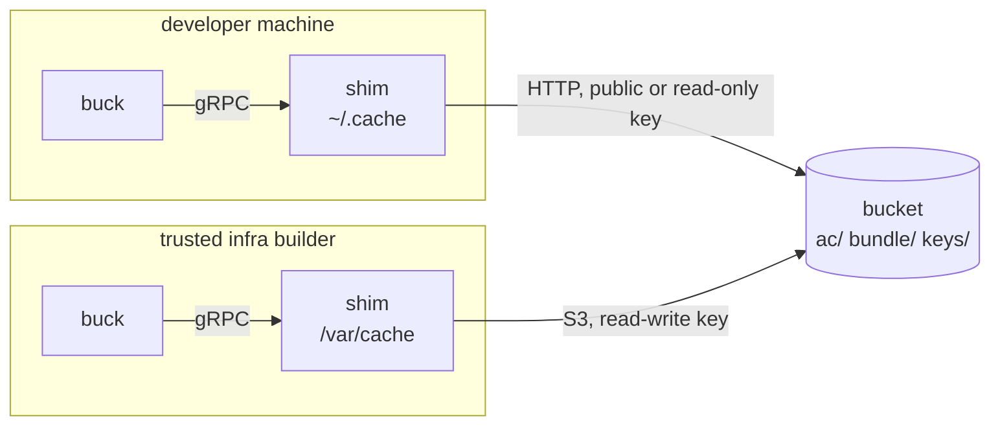

<!--
SPDX-FileCopyrightText: Amutable GmbH <https://amutable.com/>
SPDX-License-Identifier: MPL-2.0
-->

# The shared build cache

Buck can take an action's result over its [remote execution
API](https://buck2.build/docs/users/remote_execution/) instead of running it locally. Then a developer
machine or an isolated CI build can download all the expensive package/Go/Rust etc. builds from the cache
instead of having to re-do them on their own machine, and only build the inputs that were actually
changed locally. Which actions are cached at all is decided in the graph, not here: see [reproducibility
and caching](../design/architecture.md#reproducibility-and-caching).

Tine implements such a cache over an S3 bucket, with unique properties: not trusting the cloud provider,
being robust against data corruption, reading with plain HTTP/public buckets, and functioning with dumb
bucket expiry rules. See the [design document](../design/remote-cache.md) about how this is achieved.

Every party runs a local cache shim:

## Configuration

A project switches the cache on with a `[cache]` table in `tine.toml`, or in `tine.local.toml` for one
machine. Paths are relative to the project root. A key set in both takes its value from `tine.local.toml`.
Some keys are refused in `tine.toml`: `dir` as it's machine specific, and `unsigned`/`s3_insecure` as a
checked out branch must not weaken a configured cache.

| key | role | description |
|---|---|---|
| `read_url` | all | base URL the bucket is read from over plain HTTP, e.g. a bucket's public domain |
| `authority` | all | CA certificate files (PEM) whose leaves may sign results |
| `s3_bucket`` | builder | results get uploaded to this bucket name |
| `s3_endpoint` | builder | the bucket's S3 API end point; host name only, no scheme, path |
| `s3_key_file` | builder | S3 write token: `<id> <secret>` |
| `signing_key`, `signing_certificate` | builder | the leaf key and certificate, see [The keys](#the-keys) |
| `object_lifetime` | builder | the bucket's age rule in days, which nothing signed may outlive |
| `dir` | optional | the local store, `~/.cache/tine/cache` by default |
| `store_size` | optional | MB of output bytes the store keeps before evicting |
| `port` | optional | the loopback port the shim serves on, derived from `dir` by default |
| `enabled` | optional | `false` switches the cache off without removing the rest |
| `unsigned` | local testing | `true` to trust whoever writes the bucket, instead of `authority` |
| `s3_insecure` | local testing | talk plain HTTP to the S3 endpoint |

`tine buck` then starts the shim before a build if nothing serves the store yet, and registers itself
with it. The shim exits after 15 minutes of idleness, but never while a build that registered is still
running: a single action can take much longer than that, and the lookup after it still has to be
answered. `tine cache-status` shows what serves the store and what it has been doing; the shim's log is
under `~/.cache/tine/cache-shim/`.

A daemon reads the cache address when it starts. After changing `port` or `dir`, a daemon in another
isolation dir still holds the old one. Run `tine buck --isolation-dir <dir> kill` to adjust.

## The keys

Two keys per builder. The **CA key** ideally lives in the build server's TPM or a HSM and never leaves
it; it signs the leaf certificate, once per rotation. The **leaf key** is an ordinary Ed25519 key file on
the same machine; it signs the cache entries. There is no list of trusted keys: a reader is given CA
certificates (`authority`) and nothing else. See the [keys section in the
design](../design/remote-cache.md#the-keys) for details.

**Use a separate CA per bucket.** A reader accepts any leaf its CA has ever issued, so a CA shared between
a staging and a production bucket would let whoever writes both copy pointers from one to the other. The
CA issues leaf certificates for its one bucket and nothing else.

**Provisioning a leaf**: an Ed25519 key made on the builder and readable only by the shim; a certificate
from the bucket's CA with `BasicConstraints CA:FALSE` and `KeyUsage digitalSignature`; set validity to
the rotation period plus the bucket's object lifetime. Then restart the builder. The builder publishes
the certificate to the bucket itself, and readers pick it up from there: rotating the leaf changes
nothing on any reader.

**Rotating the CA**: add the new certificate to every builder and reader `authority`, switch the builder
to a leaf under it, remove the old certificate once nothing signed under it is left in the bucket.
Readers accept several authorities for these transition periods. An expired authority is dropped with a
warning at startup. It is a startup error if no valid authorities exist. Rotating the CA is also the
revocation: a stolen leaf key otherwise stays valid until its `notAfter`.

## The bucket

It contains three prefixes: `ac/` for the signed pointers, `bundle/` for the outputs, `keys/` for the
builders' certificates. Readers need the base URL, builders a key that may write.

Set an expiry age appropriate for the turnover of your project, over `ac/` and `bundle/` only. The
builder needs to know that age (`object_lifetime`), so that it stops signing before a result would
outlive its certificate. Leave `keys/` out of the rule: a builder publishes its certificate there when
its shim starts and not again, so an age rule deletes it out from under pointers that are still good, and
every reader refuses them from then on. Certificates are a few hundred bytes and expire by their own
`notAfter`.

Whatever fronts the bucket may cache `bundle/` freely: those objects are immutable, and a bundle is named by
its content. It must not cache `ac/` or `keys/`: they are rewritten in place, and it must not cache a 404
for anything.

This was checked with [Cloudflare R2](https://www.cloudflare.com/products/r2/): its `r2.dev` domain caches
none of these. It is also rate-limited and documented as not for production, so a big deployment needs a
custom domain with caching left off for those two prefixes.

The domain should serve every object as `application/octet-stream` with `X-Content-Type-Options:
nosniff`. The shim never looks at a content type, but whoever holds the write key can store HTML under
any key with a content type of their choosing, and a public read domain that serves it as such is a place
to host phishing pages. That is the one thing bucket write access buys that is not about the cache.

Whether the bucket is public is the deployment's choice. A cached result is the bytes anyone gets by
building the repository locally and contains the pieces of a built image, so the bucket should be private
exactly if the repository and its published images are both private.

A public bucket needs only a base URL on the read side (developer machines). Private buckets with read
tokens are not supported yet.

## The local store

A directory, passed to the shim by `tine`. On a developer machine that is `$XDG_CACHE_HOME/tine/cache` by
default. A builder gets a dedicated long-lived directory outside any per-job scratch space (`dir`), so
that the next job does not start cold.

The directory is kept below `store_size` (1 GB by default), with evicting least recently used items
first. A builder should configure a bigger size to avoid re-fetches from S3.

Everything in it is checked again when served, so it can be shared between checkouts and kept across
jobs. A reader cannot upload, since it could never be served back with `authority`. A shim without an
authority (`unsigned`) does accept uploads.

A build that fails with Buck2's "expired in the RE CAS" error asked for an output the store had evicted
whose bundle has since left the bucket; `tine buck clean` recovers.

## Error reporting

Buck2 reports every kind of failure as a cache miss, and a failed upload as a warning it then ignores. So a
reader with the wrong authority, a bucket gone private and a builder whose uploads fail all look like a
slow build. The shim logs each event with its reason, and counts them by kind; `tine cache-status` prints
the counters of the shim serving the store, with its address, bucket and trust.

When a build is slower than it should be, read the counters of the machine's shim first:

- **`misses` high, `hits` near zero**: the bucket has nothing for this build. Check the builder's
  `published` counter, and that both build the same configuration.
- **`pointers refused`**: signatures do not check out, in the bucket or in the local store. Check the
  reader's `authority`, then the log for the key id and the reason.
- **`uploads refused`**: Buck offered results to a reader, which refuses them. A reader's executor is
  configured not to offer any, so this means Buck got its settings from somewhere else. The build
  is unaffected.
- **`bundles refused`**: a bundle did not match its result. Read the log; the builder re-uploads that
  bundle on its next publish.
- **`bucket errors`**: the bucket answered badly or not at all. The log has the HTTP status: network,
  permissions, or the read token.
- **`bundles gone`**: pointers whose bundle has expired. Check the bucket's age rules if it keeps happening.
- **`incomplete`**: a result whose outputs could not all be had. Usually `bundles gone` in disguise.
- **`publish failures`** on a builder: uploads fail and Buck2 only warned. Check the write key and the log.

A shim that `tine cache-status` finds not running is started by the next build.
